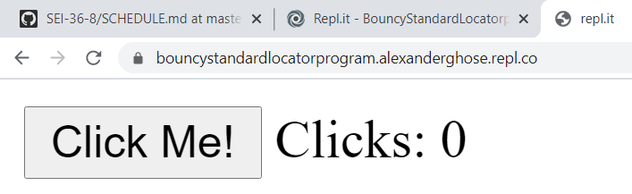
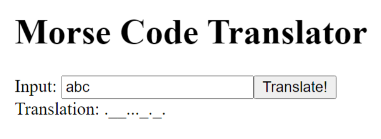

# DOM Events Lab - "Two Mini Projects" variation

## Intro

In the _DOM Events_ lesson we saw how to run a function, i.e., an event listener, when an event, such as a click, was dispatched. This lab provides practice defining event listeners used to manipulate the DOM in response to user interaction. (It also roughly follows the <a href="../guide-to-building-a-browser-game.md">guide to building a browser game</a> which is what you will follow for developing your project 1.)

### This lab is a deliverable (this is option 1 from <a href="../dom-events-lab.md">this list</a>).

<br>

## Preview

In this lab, you will be building two mini-projects using DOM events:
1. a click counter (preview <a href="preview_click_counter.PNG" />here</a>)
1. a morse code translator (preview <a href="preview_morse_code.PNG" />here</a>)

<br>

# Task 1 (Click Counter)

## Objective:

The goal is to make a click counter that goes up when you click the button. It should look something like this.

 

Feel free to use CSS styling to make it look prettier!

If you do need any hints, feel free to consult the hints below:

## Step 1. Setup the UI: 
1. For this lab, create a new repl.it and call it "Dom Events Task 1"
2. Replace the body of the html file with:
```html
  <body>
    <button id="btn1">Click Me!</button>
    Clicks:
    <span id="span1">0</span>
    <script src="script.js"></script>
  </body>
```

## Step 2. Organize the JS

* In your js file, organize your code by adding the following comments:
```js
/*----- app's state (variables) -----*/
/*----- cached element references -----*/
/*----- event listeners -----*/
```

## Step 3. Store State.
* In the state (variables) section, declare a variable to store the number of clicks, and initialize it to 0:
```js
let clicks = 0
```

## Step 4. Cache the DOM
* In the cached element references section, save a reference to your DOM elements, which will allow you to access the ```<button>```, (and also the ```<span>``` that shows the number of clicks) via the DOM:
```js
let span1 = document.getElementById("span1")
let btn1 = document.getElementById("btn1")
```

## Step 5. Attach an Event Listener:

1. In the event listeners section, write some code to attach an event listener to the ```btn1``` DOM element reference from the previous step. Your event listener should listen for a "click".
2. Within the event listener's callback function, as a test, you can put in an alert() and test it by clicking on the button. Once you've verified it's working, you may remove the alert() and move on to the next step.

## Step 6. Event Listener Logic: Updating the Program's State

* Within the event listener's callback function you created in the previous step, increment the ```clicks``` variable by 1. So when somebody clicks on the button, the ```clicks``` variable should go up by 1.

## Step 7. Event Listener Logic: Updating the UI
* Right after the update state logic you added in the previous step, use the ```span1``` dom reference variable and set its ```innerHTML``` property to be set to whatever is stored in the ```clicks``` variable. 

(Explanation: Since this span1 variable is a reference to the HTML ```<span>``` element with id="span1", this line of code will replace the HTML between the ```<span></span>``` tags, which was initialized to 0, to be whatever was stored in the ```clicks``` variable. Sweet!)<br>

Test out your code by pressing the "click me" button and watching the counter go up!


<br><br>

# Task 2 (Morse Code Translator)

## Objective:

The goal is to make a morse code translator - it should look something like this: 

If you do need any hints, feel free to consult the hints below:

## Step 1. Setup the UI
1. open up a new folder in VSCode
2. create a file called index.html and replace the body with this code: 
```html
<body>
    <h1>Morse Code Translator</h1>
    Input: 
    <input id="input1" value="abc" />
    <button id="btn1">Translate!</button><br>
    Translation: <span id="span1">Waiting for click...</span>
</body>
```
3. Make a js file called script.js
4. Link your javascript file to the HTML by putting the following line just above the <body> tag in your html:
```html
<script defer src="script.js">
```
5. Test that your javascript file is correctly linked by putting an ```alert("test!")``` as the first line of the js.
6. Open the HTML file with your browser. If you see the alert, the html and js files are linked. If you don't see the alert, double check that you linked the files correctly.

## Step 2: Organize the JS
1. In your js file, organize your code by adding the following comments:
```js
/*----- app's state (variables) -----*/
/*----- cached element references -----*/
/*----- event listeners -----*/
/*----- functions -----*/
```

## Step 3: Store state
2. In the state (variables) section, declare a variable called ```translation``` to store the current translation, and initialize it to the empty string ```""```.

## Step 4: Cache the DOM
1. In the cached element references section, declare a variable called input1 and store a reference to the ```<input>``` element that has id="input1". Hint: you can use the document.getElementById() method
2. Similarly, declare a variable called span1 and store a reference to the ```<span>``` element that has id="span1".
3. Similarly, declare a variable called span1 and store a reference to the ```<button>``` element that has id="btn1".

## Step 5. Attach an Event Listener:

1. In the event listeners section, write some code to attach an event listener to the ```btn1``` DOM element reference from the previous step. Your event listener should listen for a "click".
2. Within the event listener's callback function body, as a test, you can put in an alert() and test it by clicking on the button. Once you've verified that the button alert working, you may remove the alert() and move on to the next step.

## Step 6. Event Listener Logic: Updating the Program's State (Test)

* Within the event listener's callback function you created in the previous step, update the ```translation``` variable to be set to the ```value``` property of the ```input1``` variable (which holds a reference to the ```<input>```). 

So now when somebody clicks on the button, the ```translation``` variable should be set to whatever the user has typed in the input. In step 8, we will transform this to be an actual translation, but we just  want to make sure it's working first.

(<strong>Note</strong>: If your user types anything into an ```<input>``` element, we can get this through javascript by using the ```getElementById()``` method to access the element, and then accessing its ```value``` property, not its ```innerHTML``` property. ```<input>``` tags don't have anything useful in their innerHTML, unlike a ```<p>``` for example.)

## Step 7. Event Listener Logic: Updating the UI
1. Right after the update state logic you added in the previous step, use the ```span1``` dom reference variable and set its ```innerHTML``` property to be set to whatever is stored in the ```translation``` variable. 


Test out your code by typing something in the ```<input>``` and pressing the "Translate!" button and checking if the ```<span>``` changes!

## Step 8. Event Listener Logic: Updating the Program's State (For real)
1. In the functions section, write a ```function translateMorse(str)``` that will accept a single string argument ```str``` and return a new string that is a morse code translation of ```str```. You can find a translation chart <a href="https://en.wikipedia.org/wiki/Morse_code">here</a>.
2. Now change the code you added in step 6,to update the ```translation``` variable to be set to the result of the translateMorse function, when its input is the string that is stored in the ```value``` property of the ```input1```. 

Test that it works!

If you get stuck, you can find a solution <a href="https://repl.it/@alexanderghose/MorseCode">here</a>. (But try not to peek!)
