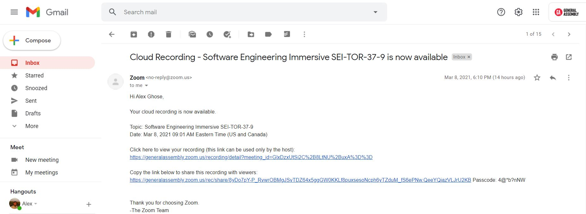
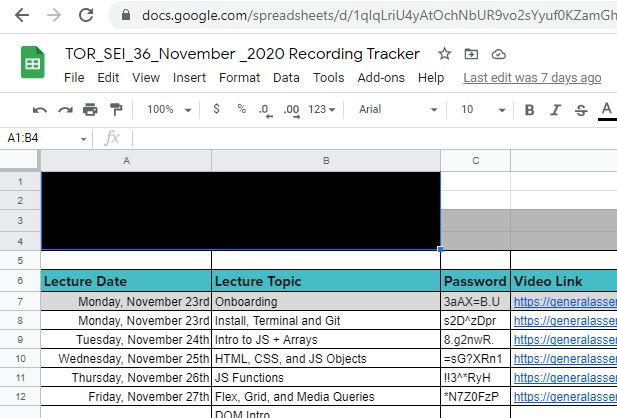

# 5 optional labs

This is a set of 5 labs that involve both back-end and front-end work that you may try in order to challenge yourself and stretch your capabilities, sorted from what I feel is easiest to hardest. 

Since all but the first one is very time-intensive, I recommend choosing only one that you really want to explore to start with. 

### Be warned: You're on your own on this!
As you attempt these, we will not be providing much support since these tasks stray a fair bit from the core material. The #sei-working-ahead or #sei-errors chat may be a good place for you to ask your peers for help. Asking your peers may also be a good strategy.

#### 5 Optional tasks overview:
1. Using flash messages
2. Scan inbox to update a google spreadsheet
3. "Ummm and errr" tracker (voice recognition API) task
4. Google maps markers: Toronto free parking (user-submitted version)
5. Timezone-faithful scheduling and booking system.

If you're able to complete any 3 of these 5, we will award you a +1 to your deliverables count.

## Optional Lab 1/5: Req.flash

### Background: 
- Req.flash lets you show nice green or red flash messages, typically after the user POSTs some data to your server. For example, the green message or the red message below are both "flash" messages.

### The task: 

- Create a form that shows a req.flash message upon posting. You may roll out your own system or use one of several nodejs "flash message" modules that can be found online.

## Optional Lab 2/5: Recording tracker to google spreadsheet

### Background: 
- Your instructor gets emails from zoom every day at a random time between 6pm and 10pm with the day's recordings. The email looks like this:

Your instructor has to physically copy this email link into a publicly-accessible google spreadsheet in order for students to access. The google spreadsheet looks like this:

The consequences for posting this late are severe. Students are unable to work on missed lecture material until the link is posted. If the instructor is late with posting recordings, this does not help the students' mental state!

### Your task:
- Save your fellow peers and instructor with your coding skills!
- Write a nodejs program (or server) that will:
    1. periodically check a gmail inbox (i recommend creating a throwaway gmail account for this lab), and, 
    2. if a new recording link has been sent from the zoom people (that hasn't already been posted), post it onto a google spreadsheet that you will create
- use the popular <a href="https://github.com/mscdex/node-imap">node-imap</a> npm library to scan your inbox, and use the convenient <a href="https://github.com/theoephraim/node-google-spreadsheet">google-spreadsheet</a> npm library to post to your spreadsheet.
- Send the code to your instructor because Alex actually really needs this quite badly.

## Optional Lab 3/5: "Ummm and errr" tracker

### Background:
- Your instructor says "umm" and "errr" a lot during lecture. They would like to be able to track how many times this happens in order to be able to improve the delivery of lectures.

### Your Task:
- Use your coding skills to make your instructor a better public speaker!
- Write an express server that will do the following:
    1. When the user goes to localhost:3000, the user can press a button to start the browser's built-in voice recognition API to start listening to the user's microphone. (Here's an <a href="https://browser-recognition.glitch.me/">demo example</a>, and here is a <a href="https://www.twilio.com/blog/speech-recognition-browser-web-speech-api">tutorial on how to build the example</a>)
    2. As the user speaks, it should display all the words the user is speaking, and highlight and count the number of "filler words" such as "umm" and "ahh" and "errr".
    3. Furthermore, this information should be sent to a mongoDB database, and saved there.
    4. (optional) Create an additional page like localhost:3000/stats so that your user can see their "filler words usage" progress over time.

## Optional Lab 4/5: Google maps markers: Toronto free parking (user-submitted version)

### Background:
- There is a great website called <a href="http://torontofreeparking.ca">torontofreeparking.ca</a> which lists a lot of the known and unknown places to park for free in Toronto, 
- The problem is that it hasn't been updated in a while. 
- Wouldn't it be nice if users could submit free parking spots, and delete them so the website would be self-updating?

### Task
1. Create a webserver such that when a user goes to localhost:3000, they see a map centered on Toronto. (Note: as google maps API is no longer free, I recommend using openstreetmap or another alternate instead. or you can use google maps API and restrict/disable the billing option)
2. Create a form wherein the user can submit free parking spots - either have them submit the latitude and longitude directly, or some other convenient way.
3. Store the user-submitted latitudes and longitudes in a MongoDB database.
4. For every latitude and longitude in your DB, drop a marker on the correct position in your map.

## Optional Lab 5/5: Timezone-faithful scheduling and booking system

Scheduling and booking systems are hard but rewarding to implement. there's lots of complexity to do with time zones and availability, so this is a good one to tackle if you're feeling brave.

### Background:
- The pokemon clinic in Viridian City has 3 staff members: nurse joy, doctor oak, and gary oak. They need to be able to set their availability, which changes every day. And patients need to be able to book them.

### Task:
- Create a webserver that will:
    1. Create a form to allow each of the staff members to submit their availability for a day, which will be stored in the database. All database times should be in UTC. 
    2. Create a form to allow patients to book a doctor ONLY if they are available and unbooked when the patient requests it. If the booking is valid, it goes through, and the database should store this appointment. All database times should be in UTC.
    3. Create a page where anyone can publicly see all the bookings and availabilities of the staff members. These times should be in the timezone of the local user. So if I'm in EST, i will see times in EST time. If i'm in London, i will see times in GMT time on this page.
    4. This will be a fairly challenging task. Good luck!
